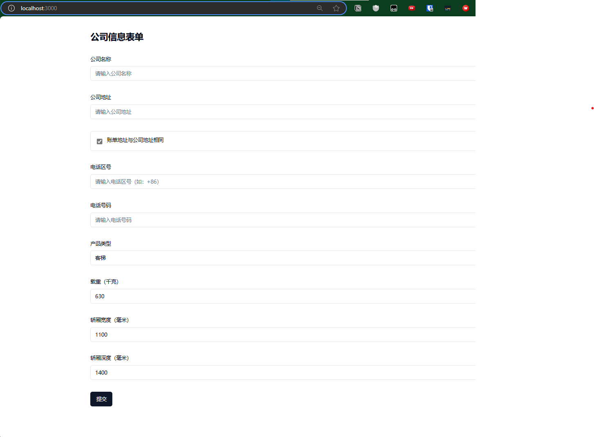

# 公司信息表单项目

这是一个使用 Next.js 和 TypeScript 开发的公司信息收集表单项目。

## 功能特点

- 公司基本信息收集
- 实时表单验证
- 动态载重选项
- 响应式设计

## 运行效果

### 终端运行界面


### 表单界面



## 技术栈

- Next.js 14.1.0
- TypeScript
- React Hook Form
- Zod 表单验证
- Tailwind CSS
- shadcn/ui 组件库

## 快速开始

1. 安装依赖：
```shell
make install
```

2. 启动项目：
```shell
make
```

服务器将在 http://localhost:3000 启动。

## 表单字段说明

- **公司名称**: 必填项
- **电话号码**: 必须是有效的国际电话号码（如：+86xxxxxxxxxx）
- **分机号**: 可选项，必须是数字
- **公司地址**: 必填项
- **服务地址**: 可选项，如果与公司地址相同可以留空
- **产品类型**: 三选一
  - 客梯
  - 自动扶梯
  - 自动人行道

### 电梯参数配置

以下参数仅在产品类型选择"客梯"时显示：

#### 载重（千克）
- 默认选项：630、1000、1250
- 自定义值范围：200-10000

#### 轿厢宽度（毫米）
- 默认选项（根据载重）：
  - 载重 630kg：1100
  - 载重 1000kg：1200
  - 载重 1250kg：1200、1600
  - 其他载重：无默认选项
- 允许自定义输入
- 自定义值范围：1000-2000

#### 轿厢深度（毫米）
- 默认选项（根据载重和宽度）：
  - 载重 630kg：1400
  - 载重 1000kg：2100
  - 载重 1250kg 时：
    - 宽度 1200mm：2100
    - 宽度 1600mm：1400
  - 其他载重：无默认选项
- 允许自定义输入
- 自定义值范围：1000-2500